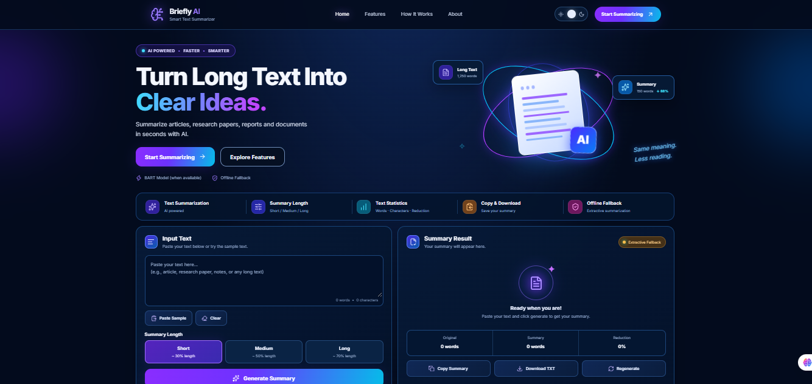

# Briefly AI: Redesigned Website

Briefly AI is a responsive and animated Flask-based web application designed to provide an improved text summarization experience. The website follows the supplied Briefly AI reference design and includes the original local BART summarization model with a frequency-based extractive summarization fallback.

## Website Screenshots

### 1. Home Page

### 2. Text Summarizer

### 3. Image Summarizer

## Features

- Responsive website design for desktop, tablet, and mobile devices.
- Animated user interface with a light theme.
- Text summarization using the `facebook/bart-large-cnn` model.
- Frequency-based extractive summarization as a fallback.
- Flask backend for processing summarization requests.
- JavaScript frontend interactions and API requests.
- Local model loading without automatic downloads.

## Run Locally

1. Install Python 3.10 or newer.
2. Open a terminal in the project folder.
3. Install the required dependencies:

   `pip install -r requirements.txt`

4. Start the Flask application:

   `python app.py`

5. Open the following address in your browser:

   `http://127.0.0.1:5000`

## Model Behavior

The application loads the `facebook/bart-large-cnn` summarization model from the local cache. It does not automatically download the model.

If the model is unavailable, the application uses a frequency-based extractive summarization method. This method assigns scores to sentences based on word frequency and selects high-scoring sentences from the original text to produce a shorter version.

The fallback provides basic summarization without requiring the BART model.

## Project Structure

- `app.py`: Contains Flask routes and summarization logic.
- `templates/index.html`: Defines the website structure and HTML content.
- `static/css/style.css`: Contains visual styling, responsive layouts, animations, and light-theme design.
- `static/js/script.js`: Handles frontend interactions and API requests.
- `requirements.txt`: Lists the Python dependencies required to run the application.

## Technologies Used

- Python
- Flask
- Hugging Face Transformers
- BART Large CNN
- HTML5
- CSS3
- JavaScript

## Purpose

Briefly AI aims to simplify long-text reading by generating concise summaries. It combines an abstractive summarization model with an extractive fallback to support basic summarization when the local model is unavailable.
